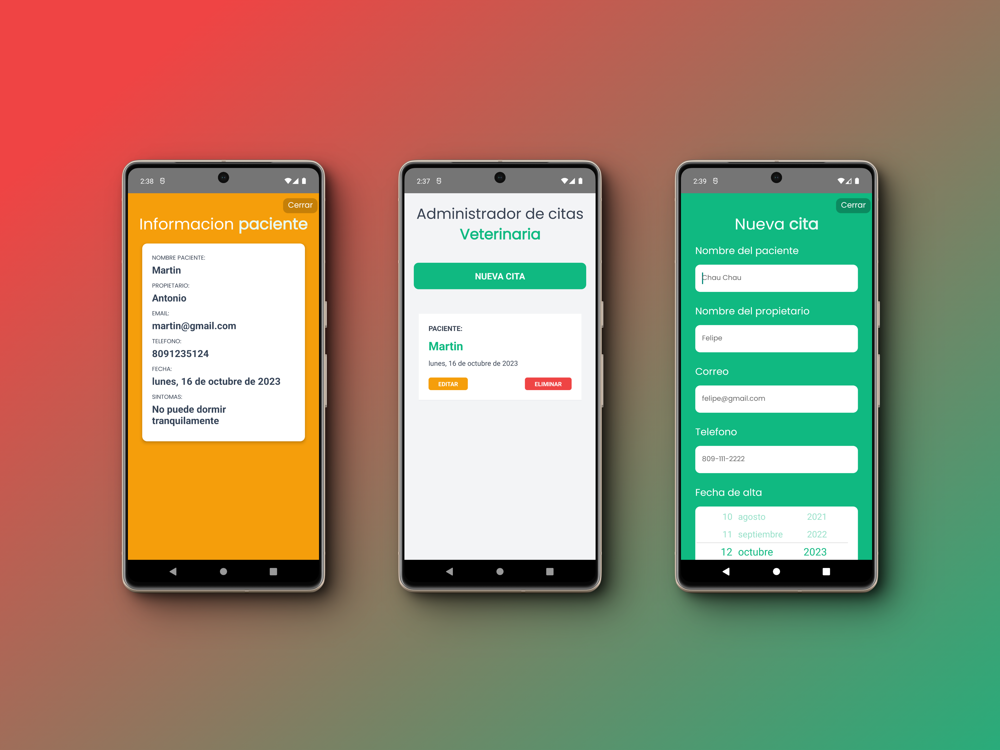

# PetCitas App

¡Bienvenid@! - Este es un proyecto que se trata en intentar crear una aplicacion sencilla que permita llevar un registro de los pacientes animales de una veterinaria.

Este README te servirá para que puedas probar el proyecto donde gustes.

## Tabla de contenido

- [Vista Previa](#vista-previa)
- [Requisitos](#requisitos)
- [Instalación](#instalación)
- [Uso](#uso)

## Vista previa



## Requisitos

Antes de poder utilizar el proyecto asegúrate de que tengas estos programas instalados antes:

- [Emulador de Android](https://developer.android.com/studio) (necesario para que puedes emular el dispositivo para correr la app)
- [Node.js](https://nodejs.org/) (cualquier version LTS)
- [Git](https://git-scm.com/) (necesario para que puedas clonar el repositorio)

## Instalación

1. Clona este repositorio en tu maquina:

   ```bash
   git clone https://github.com/louysdev/petcitas-app
   ```

2. Entra a la carpeta del repositorio:

   ```bash
   cd petcitas-app
   ```

3. Instalas las dependencias necesarias:

```bash
  npm install
```

## Uso

Para que puedas levantar el proyecto localmente, utiliza este comando

```bash
  npm run start
```

Se abriran varias terminales con la ejecucion de la aplicacion, selecciona la opcion de abrir en android y listo, disfruta de la app.

##

Happy Hacking!
